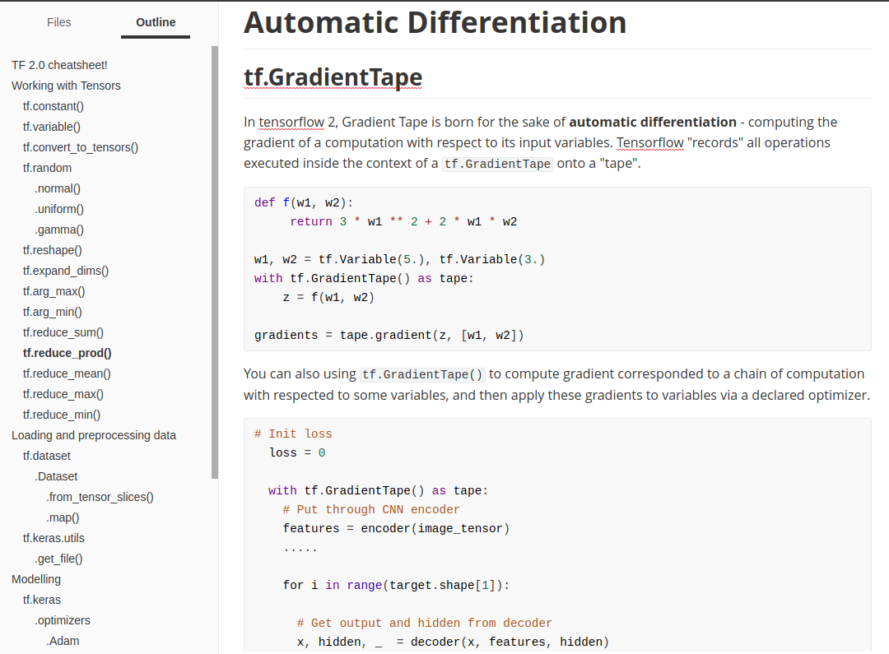

 

# TF 2.0 cheatsheet!

A **minimal** doc on **Tensorflow 2.0**  (let's call it a cheatsheet!) that you don't need to wander around and  start being confused of all modules available in Tensorflow (If you're a  newbie), because I already put all the things in one place, only **necessary things**  are mentioned in the cheatsheet that is just enough to make you  dangerous. So you can later learn by yourself more complex modules in  Tensorflow.

`Author`   Patrick Nguyen (University of Information Technology, Vietnam) 

`References` from Tensorflow docs and bunch of places on the internet!

 